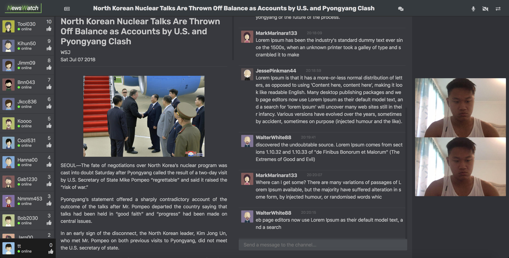
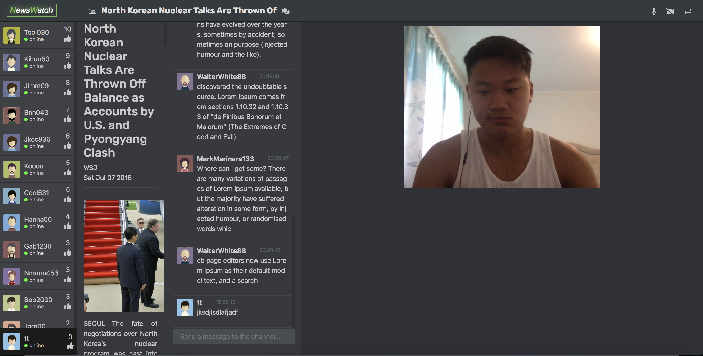

# LH7.FinalProject: NewsWatch

NewsWatch is a full stack web application built with Node, Express, React, and Webrtc that allow many users to connect together. Similar to Reddit, NewsWatch is a
social news aggregation, web content rating, and discussion website. It allows registered user to post links, images, gifs, etc. A new feature of this
app was made available with webrtc and that is live streaming between registered users to discuss the content of a particular post.

## Final Product

## Dependencies

- Node
- Express
- bcryptjs
- body-parser
- cookie-session
- express
- knex
- pg
- socket.io
- babel
- bootstrap
- liowebrtc
- react
- node-sass
- webpack

## Expected Usage

Switch into the Main directory and install the dependencies (using the `npm install` command) first and then proceed below.

This program should be executed from the command line, in the following manner:

`npm start`
